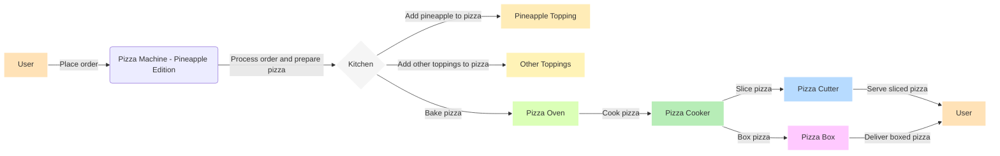

# Pizza Machine - Pineapple Edition

### Project Description
The Pizza Machine - Pineapple Edition is a project aimed at developing a pizza machine capable of producing delicious pizzas with pineapple toppings, catering to the preferences of pineapple pizza enthusiasts. The machine will automate the entire pizza preparation process, ensuring consistency in quality and taste.

### Key Features
1. **Automated Dough Preparation:** Implement a system for automatically preparing pizza dough, ensuring consistent quality.
2. **Sauce Dispensing Mechanism:** Develop a mechanism for evenly spreading tomato sauce on the pizza base.
3. **Cheese Application System:** Design a mechanism for applying an even layer of cheese on the pizza to achieve the desired texture.
4. **Pineapple Topping Dispenser:** Create a specialized dispenser for accurately distributing pineapple toppings across the pizza.
5. **Customization Options:** Incorporate user-friendly interfaces to allow customers to customize their pineapple pizzas, such as adjusting the quantity of pineapple or choosing additional toppings.
6. **Automated Cooking Process:** Implement an automated cooking process to ensure pizzas are cooked to perfection, taking into account the pineapple toppings.

### Development Stages
1. **Requirements and Planning:** Define project requirements, goals, and milestones. Develop a detailed project plan, including timelines and resource allocation.
2. **Mechanical Design and Prototyping:** Design the mechanical components of the pizza machine and create prototypes for testing and refinement.
3. **Automation Software Development:** Develop the software for automating the pizza preparation and cooking processes. Implement customization options and user interfaces.
4. **Quality Control Mechanisms:** Integrate quality control features to monitor and ensure the quality of pizzas. Implement error handling and reporting mechanisms.
5. **User Interface Development:** Design and develop user interfaces for customers to interact with the pizza machine, prioritizing a positive user experience.
6. **Integration with Ordering System:** Integrate the pizza machine with an ordering system for streamlined order processing. Test the end-to-end order placement and pizza production workflow.
7. **Testing and Quality Assurance:** Conduct comprehensive testing of all components and features. Address any issues identified during testing.

### Success Criteria
The success of the Pizza Machine - Pineapple Edition project will be evaluated based on the following criteria:

- Successful deployment of the Pizza Machine - Pineapple Edition.
- Positive feedback from users and customers.
- Consistent production of high-quality pineapple pizzas.

### Installation and Usage
To install and run the Pizza Machine - Pineapple Edition project:

1. Clone the repository: `$ git clone https://github.com/your-username/pizza-machine-pineapple-edition.git`
2. Install the required dependencies: `$ npm install`
3. Start the pizza machine: `$ npm start`

### Contribution Guidelines
We welcome contributions from the community to enhance the Pizza Machine - Pineapple Edition project. If you would like to contribute, please follow these guidelines:
- Fork the project repository and create your branch: `$ git checkout -b feature/your-feature-name`
- Commit your changes and push to your branch: `$ git commit -am "Add your feature description"`
- Submit a pull request to the `develop` branch for review and merging.

### Credits
This project is developed by the following team members:
- John Smith: [GitHub Profile](https://github.com/johnsmith)
- Emma Johnson: [GitHub Profile](https://github.com/emmajohnson)

We would also like to thank the creators of the following resources that helped us in building this project:
- [Pizza Dough Recipe](https://www.example.com/pizza-dough-recipe)
- [Automated Food Processing Tutorial](https://www.example.com/automated-food-processing-tutorial)

### License
This project is licensed under the [MIT License](https://opensource.org/licenses/MIT).

For more information on how to choose a license for your project, refer to [Choose a License](https://choosealicense.com/).